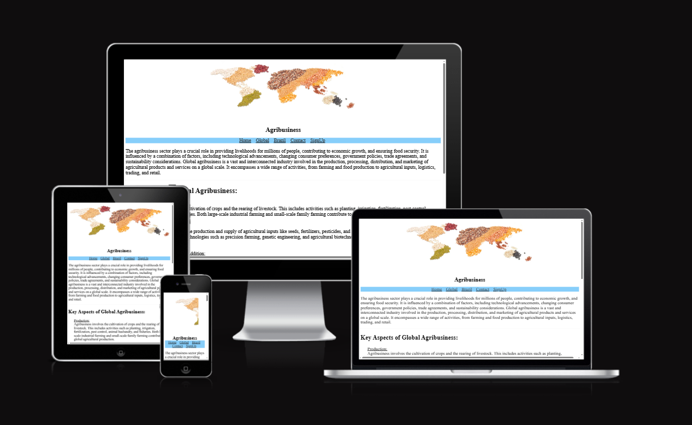
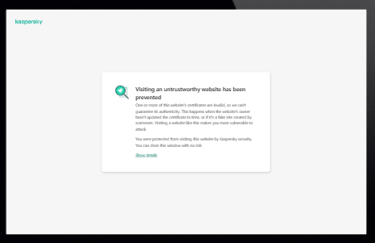
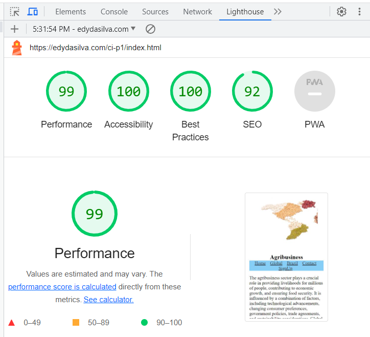

# Agribusines

This website brings a brief insight in Global agribusiness.
 
Agribusiness is closely tied to international trade, with agricultural commodities being significant exports for many countries. It involves the buying, selling, and trading of agricultural products on the global market, influenced by factors such as demand, prices, trade policies, and quality standards.
 

## Topics

### Global Market

### Brazilian market share

## Usage
We just provide some information on agribusiness contrasting to the Brazilian market share on the global environment.

## Features
<b>interactive Front-End web</b>
 
Menu for page navigation

  

## Pictures ilustrating information

Users can have a better understanding of related figures
 

## Technologies used

<ol>
    <li>HTML</li>
    <li>CSS</li>
</ol>

## Code Validation
W3C Markup Validation Service
W3C CSS Validator (Jigsaw)

 

## Testing
### Elements tested and inspected including for mobile and tablet on different browsers 

## Bugs
Pending SSL certificate from hosting
  

## Performance
Performane evaluation with lighthouse

##  Deplyment and Version Control

GitHub for version control and deployment.
 

### Visit the project web page
https://edydasilva.github.io/CI-P1-agribusiness/

## Media and data content

Google and PWC

## Acknowledgements

Code Institute team
