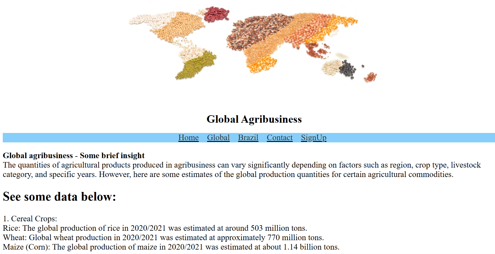
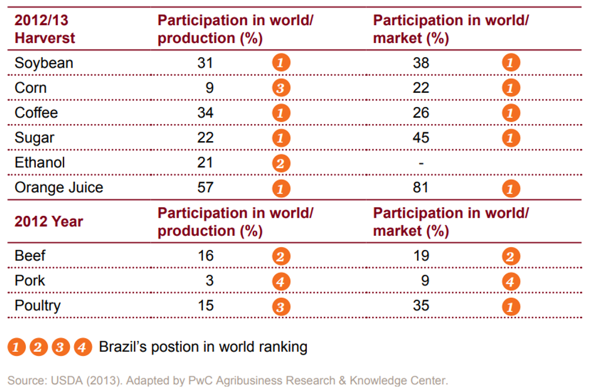
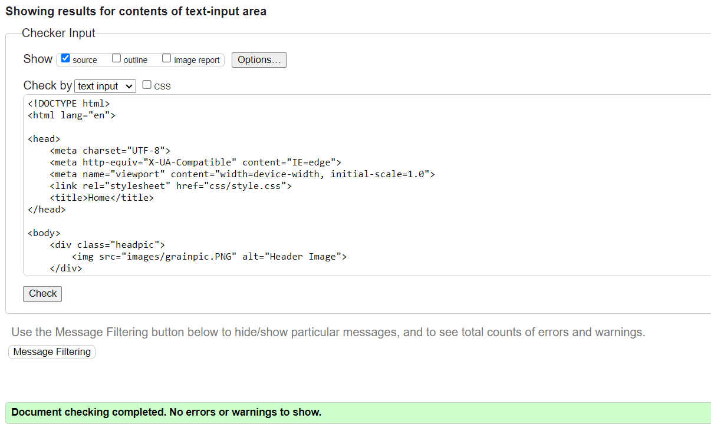
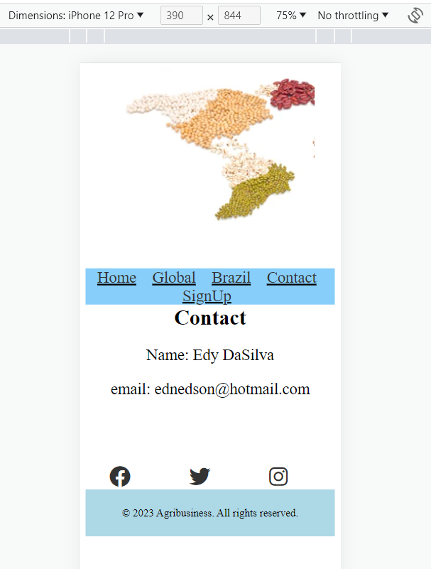
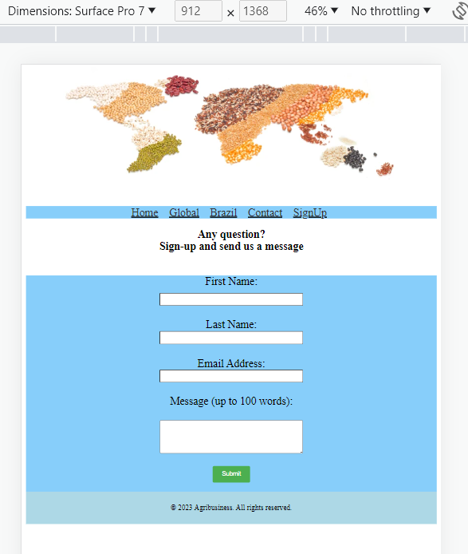

# Agribusines

This website brings a brief insight in Global agribusiness.
 
Agribusiness is closely tied to international trade, with agricultural commodities being significant exports for many countries. It involves the buying, selling, and trading of agricultural products on the global market, influenced by factors such as demand, prices, trade policies, and quality standards.
 

## Topics

### Global Market

### Brazilian market share

## Usage
We just provide some information on agribusiness contrasting to the Brazilian market share on the global environment.

## Features
interactive Front-End web

Menu for page navigation

  

## Pictures ilustrating information

## Technologies used

<ol>
    <li>HTML</li>
    <li>CSS</li>
</ol>

## Code Validation
W3C Markup Validation Service
W3C CSS Validator (Jigsaw)

 

## Elements inspected including for mobile and tablet

## Version Control

GitHub for version control.
 

### Visit the project web page
https://edydasilva.github.io/CI-P1-agribusiness/

## Media content

Google and PWC

## Acknowledgements

Code Institute team
